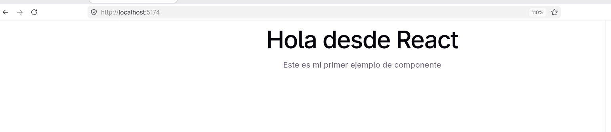

# Ejemplo minimo de React
Se me ocurrió separar App.jsx y EjemploMinimo.jsx

## Crear el proyecto con node
```bash
npm create vite@latest 001-ejemplo-minimo -- --template react
cd 001-ejemplo-minimo
```

## Colocar los archivos en src/
/001-ejemplo-minimo/src/App.jxs
```jsx
import React from 'react';
import EjemploMinimo from './EjemploMinimo';

function App (){
    return(
        <div>
            {/* Aqui se renderiza el componente con su etiqueta en mayuscula */}
            <EjemploMinimo/>
        </div>
    );
}
// exportar para que vite pueda inyectarlo en el navegador
export default App;

```

/001-ejemplo-minimo/src/EjemploMinimo.jsx

```javascript
function EjemploMinimo (){
    return(
        <div>
            <h1> Hola desde React </h1>
            <p>Este es mi primer ejemplo de componente</p>
        </div>
    );
}
 export default EjemploMinimo;

```

## Probar
```bash
npm run dev
```

## vista en el navegador
En localhost:5174

El ejemplo mas sencillo

