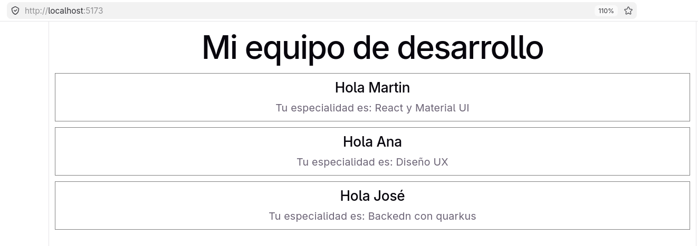

## Ejemplo de props para reutilizar targetas
Se reutiliza el componente Targeta saludo

## Crear el proyecto base
```bash
npm create vite@latest 001-props -- --template react
cd 001-props
npm run dev
```
## resultado en el navegador
Resltado 

..

