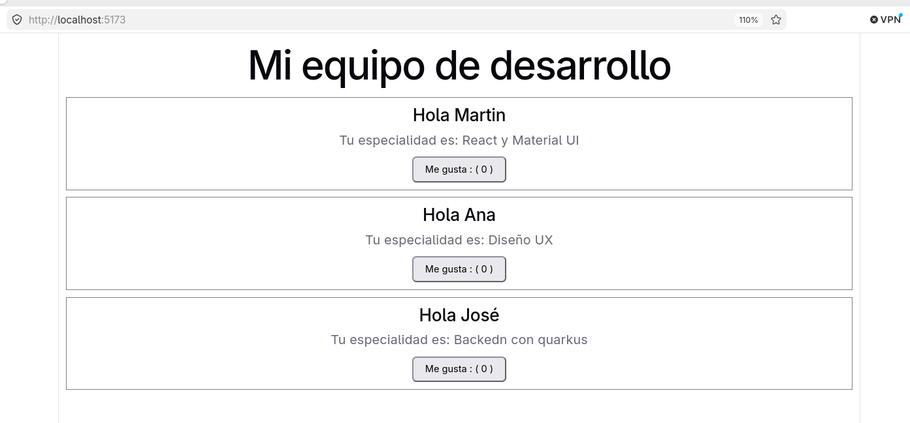

## Diferencia entre prop y state
**prop**
 
 - Propósito:   Configurar el componente desde aafuera.
 - Controlado:  Por el padre
 - Modificable: No

 **state**

 - Propósito:   Recordar información interactiva desde dentro 
 - Controlado:  El mísmo
 - Modificable: Si, con herramientas de React

**Se usa state** cuando se requiere que cambie la interfaz

 - Al escribir en un formulario
 - Al hacer clic
 - Al recibir datos de backend

 Cómo ya no se usan clases, se usan funciones gestionadas mediante Hooks
 <br>
 Hook **useState**

## Ejecucion
```bash
npm create vite@latest 001-use-state -- --template react
cd 01-usestate
npm run dev
```

## resultado
Resultado de el Hook State con el boton Me gusta



## dudas con un segmento de código
Dudas con
```javscript
const manejarClic = () => {
    setLikes ( likes +1 );
};

```
Me sigue haciendo ruido 

Se usa la función setLikes que nos regaló el Hook useState
## esaba probando ilv
Como que si me esta gustando el resultado
Esto me gusta mas, ya pies si me quedé con inlyne
